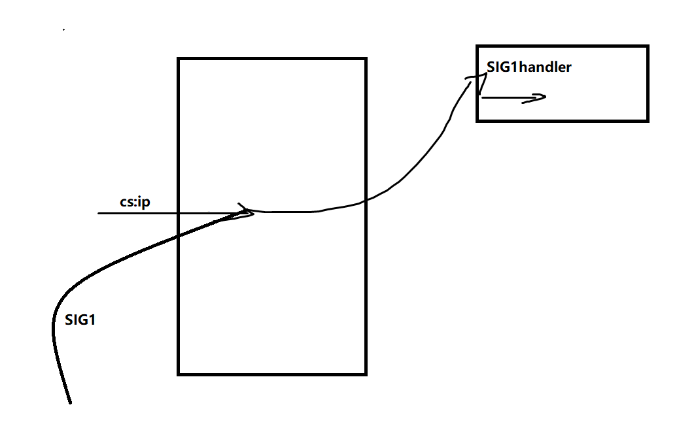

# 	Tcp服务器框架设计/LinuxWeb服务器项目

# 前言

**本文涉及的各种系统调用请参考Richard Stevens的《UNIX环境高级编程》《UNIX网络编程》；**


### 本文是我在LinuxWeb服务器开发过程后总结的一些精髓以及开发过程中的选择策略的思路描述。

参考《LINUX高性能编程》 《LINUX高性能服务器端编程》《UNIX环境高级编程》《UNIX网络编程》从其中得出来的一些心得。 fix

如有错误，望请指正。


先贴一张TCP状态图，这是分析网路连接问题的基础

要修改的加上UNP上的图


# 服务器为什么选择Web服务器？

1.Web服务器逻辑相对简单，不用花费很大心思花在业务逻辑上，重心可以放在优化TCP内部上。

2.Web服务器虽然简单，但可以将大部分知识串联起来，易于自己形成一个知识体系。

3.Web客户端简单易得（很多浏览器可以用）。

## IO模块

##### 从0开始如何编写一个tcp服务器？

首先我画一个三次握手的图


编写一个Server最开始的工作即是：选择你想要监听的网络对象（IP/PORT）并存储在一个容器中。建立一个SOCKET与网络对象绑定，绑定后将其转化为listenfd即监听套接字用以监听网络对象。

这样已经完成了一大部分。接着当有连接到来时会存储在协议栈的半监听队列，并且listensocket会自动建立**backlog+1范围**以内的半连接将之移到为全连接当中。接着我们需要利用内核提供的accept系统调用去提取全连接队列中的结点。如下图所示


##### backlog参数对listen的影响


上行是backlog为1，下行是backlog为3。

**backlog ==1** :上行3个连接对，有一个处于SYN_SENT状态说明Client没有收到Server发来的SYN与ACK

**backlog ==3** :下行4个连接对，有一个处于SYN_SENT状态说明Client没有收到Server发来的SYN与ACK

可见我们注意两点：

**1.半连接队列只处理backlog+1的连接请求**

**2.自内核2.2版本以后backlog只限定全连接队列，半连接队列的大小在/proc/sys/net/ipv4/tcp_max_syn_backlog中限定**


##### accept内部到底是怎样的？

**先说结论：accept只是单纯的从全连接队列中取出结点，它并不知道客户端网络到底断没断开**

```cpp
#include <sys/socket.h>
#include <netinet/in.h>
#include <arpa/inet.h>
#include <signal.h>
#include <unistd.h>
#include <stdlib.h>
#include <assert.h>
#include <stdio.h>
#include <string.h>
#include <errno.h>

#define IP "192.168.154.128"
#define PORT "12346"
#define BACK_LOGLENGTH 3


int main(int argc, char* argv[])
{

    //创建一个IPV4 socket地址容器。     1.初始化 2.设置ipv4地址(注意转为网络端)
    const char* ip = IP;
    int port = atoi(PORT);
    struct sockaddr_in address;
    bzero(&address, sizeof address);
    address.sin_family = AF_INET;
    inet_pton(AF_INET, ip, &address.sin_addr);
    address.sin_port = htons(port);


    //建立一个socket用以监听。   1.创建一个socket 2.将socket绑定监听端口转化为listen socket 并赋于监听队列长度  3.监听，等待连接
    int sock = socket(PF_INET, SOCK_STREAM, 0); //ipv4,tcp,0(默认为0即可，前两个值确定了是什么协议)
    assert(sock >= 0);
    //设置端口复用
    int reuse = 1;
    setsockopt(sock, SOL_SOCKET, SO_REUSEADDR, &reuse, sizeof(reuse));

    int ret = bind(sock, (struct sockaddr*)&address, sizeof(address));
    assert(ret != -1);

    ret = listen(sock, BACK_LOGLENGTH);
    assert(ret != -1);


    sleep(30);

    //用一个容器存储远端地址，由OS写故要指定长度。
    struct sockaddr_in client;
    socklen_t client_addrlength = sizeof(client);
    int connfd = accept(sock, (struct sockaddr*)&client, &client_addrlength);
    if (connfd < 0)
    {
        printf("errno is :%d\n", errno);
    }
    else
    {
        char remote[INET_ADDRSTRLEN];
        printf("远端：IP:%s PORT:%d 已经连接\n", inet_ntop(AF_INET, &client.sin_addr, remote, INET_ADDRSTRLEN), ntohs(client.sin_port));
        close(connfd);
    }


    close(sock);
    return 0;
}
```

先上来一个测试文件，简要说明下这个测试cpp文件表达的意思：

两端建立连接后，在30秒内即accept执行之前给我们对端充裕的时间去断开客户端连接，然后看看会发生什么


运行过程中查看连接（此时是在30秒之内并没有继续向下执行）


说明此时连接已断开。

再等待accept执行。


这说明accept并不知道对端是否处于连接中，而是直接从全连接队列中取出结点,三次握手是内核栈帮你完成的，而不是accept。accept不论连接处于何种状态，只是从监听队列中取出结点。取出的同时再拿一个fd用以描述该结点，我称之为**cfd**,这个cfd是继承lfd的一些SOCKET选项的。


##### 建立连接之后服务端的基本处理


注意几点：

1.内核缓冲区的大小可能大于应用缓冲区，故一次读是不一定能读完的，一般设为多次读。

2.在接收数据的过程中，难免会有紧急数据（带外数据OOB）产生，这是一个异步的过程，我们无法获知何时会到来，幸好Linux内核提供了检测机制。 我们可以用IO复用技术监听socket，当socket上有带外数据产生会发生异常事件和SIGURG信号，但是应用程序收到通知还要知道带外数据在数据流中的具体位置，才能准确接收。这一点可以通过`int sockatmark(int sockfd)`判断sockfd是否处于带外标记，即下一个被读取到的数据有带外数据就会返回1，此时我们便可以用`MSG_OOB`标志的recv进行接收OOB数据。如果不是，`sockatmark`返回0

3.设置TCP缓冲区大小时，内核指定过一个最小值，如果被指定的数小于该最小值那么会被强制设置成最小值。如果大于则会设置为其的两倍。


##### 阻塞式IO与非阻塞式IO

IO操作是要等磁盘里面的数据读出来进入CPU处理。如果是单线程，阻塞式IO就会造成CPU利用率低。 多线程可以解决该问题，当然线程也不能开太大，否则频繁造成上下文切换开销很大。非阻塞式IO不一定比阻塞式IO快。那为什么现在的网络框架都喜欢多线程非阻塞式IO搭配呢？首先要知道多线程本身并不能提高效率，因为他反而会在一定程度上降低CPU效率（特别是在线程数远远大于CPU核心数时），多线程的好处在于异步，避免一个线程在等待其他资源时。非阻塞式IO能够在一定程度下减小服务器瞬间的并发线程数，从而提高CPU执行效率。 这也是为什么epoll LT模式+ 非阻塞式IO吞吐量更大。 fix


##### 如何解决粘包分包问题，粘包分包问题的本质

虽然采用HTTP协议是没有粘包分包的问题，那么如果到了需要清晰分辨各个包的场景该如何做呢？推荐以下四种方法

- **发送定长包**。如果每个消息的大小都是一样的，那么在接收对等方只要累计接收数据，直到数据等于一个定长的数值就将它作为一个消息。
- **包尾加上\r\n标记**。FTP协议正是这么做的。但问题在于如果数据正文中也含有\r\n，则会误判为消息的边界。
- **包头加上包体长度**。包头是定长的4个字节，说明了包体的长度。接收对等方先接收包体长度，依据包体长度来接收包体。
- **使用更加复杂的应用层协议**。


对于第三种多说一点，这个读写函数应该是对应有处理的，Read时注意将长度从网络端切换成主机端再进行判断，这是一个坑。


**最后其实分包问题本质是recv和send的速度不一致性导致recv可能无法识别对端传来的数据格式。故如果我们不想牺牲一端的时间来保持同步的话，就用序列化的结构去管理包。这样两端可以达到异步处理提高效率。**


## IO多路复用

##### 为什么要用IO多路复用？

首先我们从阻塞IO模型开始谈，阻塞IO当一个cfd没数据时会阻塞，试想一下，你想监听很多连接，如果因为一个cfd导致你阻塞，那么后面的是不是都要阻塞等待你？就算数据来了也不能处理。那么怎么处理？唯一的办法开多线程，但是当有大量连接，线程太多就会造成很大的内存开销以及频繁的上下文切换，导致性能下降。这就是阻塞IO模型的瓶颈。相对于阻塞IO，非阻塞IO貌似可以解决开多线程的问题，我们可以通过非阻塞IO使得一个线程监听多个连接（因为没有数据就直接返回），但是前提是必须轮询。这样CPU会做大量无用功，效率有点低。那么有更好的办法吗？IO多路复用就应运而生。IO多路复用技术可以在一个线程中监听多个文件描述符，一旦某个描述符就绪就能够通知该线程，解决了开大量线程监听与轮询的缺点。

**通过以上的分析，可以得出对于大并发的连接量用IO多路复用比传统监听方式当然更好。同时要想进一步提高效率，可以开适合的线程进行提高并发量。**

IO多路复用技术在Linux有三种，select,poll,epoll，具体用法请参考Richard Stevens大佬的《UNIX环境高级编程》。select与poll是POSIX标准规定的，epoll是Linux特有的，前者可移植性高，后者只在Linux环境下使用。

对于三个系统调用，select与poll相对epoll的缺点如下：

1.select的文件描述符是被限制的（可以通过修改内核参数，但可能会出现一些意料不到的现象）

2.select没有统一处理事件类型。

3.每次调用select都需要拷贝（指的是把fdset从用户态完整的拷贝到内核态而不是epoll的就绪队列mmap零拷贝），开销大。 fix

4.select与poll索引就绪文件描述符是通过轮询方式即O（n)即线性扫描,而epoll是采用“当有fd有事件到来通过直接回调的方式O(1）直接加入就绪队列”。 


当然epoll不是万能的，epoll适用于连接量多。但活动连接较少的情况，而当连接量多，活动连接量也很多那么epoll效率未必比select和poll高。因为此时回调函数被触发的过于频繁，而此时的select与poll扫描就绪文件描述符命中率较高。


##### 统一事件源

服务器编程中通常有三大类事件需要处理，一类是I/O事件，一类是信号事件，一类是时间事件。

信号是一个异步的IPC，当我们要为某个信号注册回调函数时，该信号到来就会执行相应的回调



如果此时又注册了另外一个信号SIG2，那么CS:iP又会跳转到SIG2hanlder


所以在处理信号函数时为了防止主逻辑被冲散，需要暂时屏蔽其他信号。然而屏蔽就万事大吉了吗？当然不是，如果说信号处理函数访问中要访问一个锁住的资源，那么这就会造成什么？线程阻塞，信号屏蔽的时间就会拉长，**所以信号处理函数应该是可重入的**。但是我们确实想让信号和含有需要访问某个资源的语义函数绑定，那么形成一个有效的事件管理机制是一个好的选择。统一事件源便是一种思想，使得主程序能够更好掌握事件处理的逻辑，而不是说哪个优先就要处理哪个造成逻辑混乱。

统一信号事件源方式

```cpp
int pipefd[2];
void sig_handler(int sig)   //信号来临只处理向主循环中发送信号到来的信息
{  
    int save_errno = errno;  
    int msg = sig;  
    send(pipefd[1], (char*)&msg, 1, 0);  //利用管道通信
    errno = save_errno;  
} 

void addsig(int sig)  
{  
    struct sigaction sa;  
    memset(&sa, '\0', sizeof(sa));  
    sa.sa_handler = sig_handler;    //注册回调
    sa.sa_flags |= SA_RESTART; 		//信号是软中断，会打断系统调用，该选项是自动恢复进行中的系统调用，便于管理
    sigfillset(&sa.sa_mask);		//在信号处理函数中屏蔽所有信号，防止中途被打断
    assert(sigaction(sig, &sa, NULL) != -1);   // 注册信号
}  

void handle_sig(int sig)
{
    switch(sig)
    {
        case SIGCHLD:
            
        case SIGHUP:
            
        case SIGTERM:
            
        case SIGINT:
            
    }
}


int main(int argc, char **argv)
{
    ret=socketpair(PF_UNIX,SOCK_STREAM,0,pipefd);    //双向管道通信
    setnonblocking(pipefd[1]);  
    addfd(epollfd,pipefd[0]);    //监听管道读端
    while(true)
    {
        int ret = epoll_wait(epollfd, events, MAX_EVENTS, -1);
        for (int i = 0; i < ret; i++)
        {
            if(events[i].fd == pipefd[0] && events[i].events & EPOLLIN) //接收到信号
            {
                char signals[1024];  
                int num = recv(pipefd[0], signals, sizeof(signals), 0);  
                if (num == -1)  
                    continue;  
                else if (num == 0)  
                    continue;  
                else 
                {  
                    //每个信号值占1字节，所以按字节来逐个接收信号  
                    //可能处理的时候收到了多个信号
                    for (int i = 0; i < num; i++) 
                    {
                        handle_sig(signals[i]);
                    } 
                }
            }
        }
    }
    ...
}

```

struct sigaction结构


注意一点，sa_mask成员用来指定在**信号处理函数执行期间**需要被屏蔽的信号，特别是当某个信号被处理时，它自身会被自动放入进程的信号掩码，因此在信号处理函数执行期间这个信号不会再度发生。


Linux上的Xinted超级服务程序也是这样做的，通过lsof查看xinted进程打开的文件描述符即可查看


Xinted打开了FIFO用以辅助实现统一事件源


## 定时器容器选择策略

承上，网络程序需要处理的第三类事件是**定时事件**。比如定期检测一个客户连接的活动状态。服务器程序通常管理着众多定时事件，因此有效组织这些定时事件，使之能在预期的时间点被触发且不影响服务器的主要逻辑，对于服务器的性能有着至关重要的影响。故我们要管理这些定时事件，需要选择一个合适的容器。

我提供两种方案—时间堆与时间轮。

##### 定时

在这之前先简要说下定时，定时是指在一段时间后触发某段代码的机制。我们可以在这段代码中依次处理所有的到期的定时器。换言之，定时机制是定时器得以被处理的原动力。

Linux提供了三种定时方法：

1.socket选项SO_RCVTIMEO和SO_SNDTIMEO

2.SIGALRM信号

3.IO多路复用系统的超时参数。


##### 升序双向链表

先上一个简单的定时器容器，来了解下什么是定时器容器。

一个定时器容器的要素要哪些？很容易想到首先必须要有索引结构，其次要有超时时间，回调函数，以及回调函数的参数（空参数可以不加入，但是加入更泛化）这些都是主要元素，当然你可以随着场景加一些额外要素。如何判断是否超时？我们可以选择依据定时器的expire值与当前系统时间做比较。

知道这些后，那么上代码（代码描述可能比我组织语言更清晰hh~)

```cpp
#include <sys/types.h>
#include <sys/socket.h>
#include <netinet/in.h>
#include <arpa/inet.h>
#include <stdlib.h>
#include <assert.h>
#include <stdio.h>
#include <errno.h>
#include <fcntl.h>
#include <unistd.h>
#include <string.h>
#include <time.h>


class client_data;

/* 定时器类 */
class Timer
{
public:
    using TimerHandler = void(*)(client_data*);
    Timer(TimerHandler cb) :prev(nullptr), next(nullptr), time_cb(cb) {};
    ~Timer() {};
   
public:
    Timer* prev; //索引结构
    Timer* next;
    TimerHandler time_cb = nullptr;  //回调func
    time_t expire; //超时时间
    client_data* user_data; 
};


/* 升序链表 */
class Sort_Timer_List
{
public:
    Sort_Timer_List() :head(nullptr), tail(nullptr) {};
    ~Sort_Timer_List()
    {
        Timer* tmp = head;
        while (tmp)
        {
            head = tmp->next;
            delete tmp;
            tmp = head;
        }
    };


    /* 将目标定时器加入到升序链表中 */
    void Add_Timer(Timer* timer)
    {
        if (timer == nullptr)
        {
            return;
        }

        if (head == nullptr)  //该链表没有结点时
        {
            head = tail = timer;
            return;
        }

        if (timer->expire < head->expire)    //该链表有结点时，但是timer的时间最小
        {
            timer->next = head;
            head->prev = timer;
            head = timer;
            return;
        }
        Add_Timer_After(timer, head);
    }

    /* 调整定时器：当某个定时器的任务改变了需要调整链表，只提供调整更大的时间接口   */
    void Addjust_Timer(Timer* timer)
    {
        if (timer == nullptr)
        {
            return;
        }
        Timer* tmp = timer->next;

        if (timer == tail || (head == tail && head == timer) || timer->expire < tmp->expire) return; //此时timer位于tail，或链表中只有一个结点 或 仍小于下一个结点的超时值 不用调整


        /*  此后的链表结点均至少大于等于2，timer不是尾结点, timer的超时值一定大于其后继结点    */

        //若timer是头结点
        if (head == timer)
        {
            head = head->next;
            head->prev = NULL;
            timer->next = NULL;
            Add_Timer_After(timer, head);

        }

        //若timer不是头节点
        else
        {
            timer->prev->next = timer->next;
            timer->next->prev = timer->prev;
            Add_Timer_After(timer, timer->next);

        }
    }

    /* 将目标定时器Timer从链表删除  */
    void Del_Timer(Timer* timer)
    {
        if (timer == nullptr)
        {
            return;
        }

        //一个结点的情况
        if ((timer == head) && (head == tail))
        {
            head = nullptr;
            tail = nullptr;
            delete timer;
            return;
        }
        //下面是两个以上结点的情况

        if (timer == head)
        {
            head = timer->next;
            head->prev = nullptr;
            delete timer;
            return;
        }
        if (timer == tail)
        {
            tail = timer->prev;
            tail->next = nullptr;
            delete timer;
            return;
        }
        timer->next->prev = timer->prev;
        timer->prev->next = timer->next;
        delete timer;
    }

    //每次来SIGALARM就触发tick函数
    void tick()
    {
        if (!head)
        {
            return;
        }

        printf("TICK! TICK!\n");
        time_t cur = time(0);
        Timer* tmp = head;

        while (tmp)
        {
            if (cur < tmp->expire) //未超时
            {
                break;
            }
            //超时执行回调
            tmp->time_cb(tmp->user_data);
            head = tmp->next;
            if (head)
            {
                head->prev = nullptr;
            }
            delete tmp;
            tmp = head;
        }
    }

private:
    void Add_Timer_After(Timer* timer, Timer* list_head)
    {
        Timer* prev = list_head;
        Timer* tmp = prev->next;
        
        while (tmp)
        {
            if (timer->expire < tmp->expire)
            {
                prev->next = timer;
                tmp->prev = timer;
                timer->prev = prev;
                timer->next = tmp;
                return;
            }

            prev = tmp;
            tmp = tmp->next;
        }

        if (!tmp)
        {
            tail->next = timer;
            timer->prev = tail;
            tail = timer;
            return;
        }        
    }
    Timer* head;
    Timer* tail;
};
```


这个一个以升序链表为容器的定时器，添加定时器的时间为了保持顺序所以要头开始遍历，复杂度为`O（n)`，删除定时器不用遍历，复杂度为`O(1)`.执行定时任务的时间复杂度为`O(1)`

​      


##### 时间轮

时间轮可以看作一个哈希表，每个槽（slot)代表一个键值，一个键值对应一个定时器链表。每个链表是无序的。一个slot代表一个一次心搏（tick)，每一次tick到来遍历对应slot上的定时器链表，对超时的定时器进行执行任务并删除。

可见插入定时器为O(1)，删除定时器O(1)，执行一个定时器为O(n)但是实际上由于散列的作用，效率远远高于上面的双向链表的O(n)。而且时间轮还有扩展性，要想更提高效率，我们可以采取加多槽数或再多加几个轮构成多级时间轮,实际情况中可以达到O(1)，总之本质是加大散列表的入口，用于负载均衡。


```cpp
#ifndef TIME_WHEEL_TIMER
#define TIME_WHEEL_TIMER

#include <time.h>
#include <netinet/in.h>
#include <stdio.h>

#define BUFFER_SIZE 64
class tw_timer;
struct client_data
{
    sockaddr_in address;
    int sockfd;
    char buf[BUFFER_SIZE];
    tw_timer* timer;
};

class tw_timer
{
public:
    tw_timer(int rot, int ts)
        : next(NULL), prev(NULL), rotation(rot), time_slot(ts) {}

public:
    int rotation;
    int time_slot;
    void (*cb_func)(client_data*);
    client_data* user_data;
    tw_timer* next;
    tw_timer* prev;
};

class time_wheel
{
public:
    time_wheel() : cur_slot(0)
    {
        for (int i = 0; i < N; ++i)
        {
            slots[i] = NULL;
        }
    }
    ~time_wheel()
    {
        for (int i = 0; i < N; ++i)
        {
            tw_timer* tmp = slots[i];
            while (tmp)
            {
                slots[i] = tmp->next;
                delete tmp;
                tmp = slots[i];
            }
        }
    }
    tw_timer* add_timer(int timeout)
    {
        if (timeout < 0)
        {
            return NULL;
        }
        int ticks = 0;
        if (timeout < TI)
        {
            ticks = 1;
        }
        else
        {
            ticks = timeout / TI;
        }
        int rotation = ticks / N;
        int ts = (cur_slot + (ticks % N)) % N;
        tw_timer* timer = new tw_timer(rotation, ts);
        if (!slots[ts])
        {
            printf("add timer, rotation is %d, ts is %d, cur_slot is %d\n", rotation, ts, cur_slot);
            slots[ts] = timer;
        }
        else
        {
            timer->next = slots[ts];
            slots[ts]->prev = timer;
            slots[ts] = timer;
        }
        return timer;
    }
    void del_timer(tw_timer* timer)
    {
        if (!timer)
        {
            return;
        }
        int ts = timer->time_slot;
        if (timer == slots[ts])
        {
            slots[ts] = slots[ts]->next;
            if (slots[ts])
            {
                slots[ts]->prev = NULL;
            }
            delete timer;
        }
        else
        {
            timer->prev->next = timer->next;
            if (timer->next)
            {
                timer->next->prev = timer->prev;
            }
            delete timer;
        }
    }
    void tick()
    {
        tw_timer* tmp = slots[cur_slot];
        printf("current slot is %d\n", cur_slot);
        while (tmp)
        {
            printf("tick the timer once\n");
            if (tmp->rotation > 0)
            {
                tmp->rotation--;
                tmp = tmp->next;
            }
            else
            {
                tmp->cb_func(tmp->user_data);
                if (tmp == slots[cur_slot])
                {
                    printf("delete header in cur_slot\n");
                    slots[cur_slot] = tmp->next;
                    delete tmp;
                    if (slots[cur_slot])
                    {
                        slots[cur_slot]->prev = NULL;
                    }
                    tmp = slots[cur_slot];
                }
                else
                {
                    tmp->prev->next = tmp->next;
                    if (tmp->next)
                    {
                        tmp->next->prev = tmp->prev;
                    }
                    tw_timer* tmp2 = tmp->next;
                    delete tmp;
                    tmp = tmp2;
                }
            }
        }
        cur_slot = ++cur_slot % N;
    }

private:
    static const int N = 60;
    static const int TI = 1;
    tw_timer* slots[N];
    int cur_slot;
};

#endif

```


##### 时间堆

时间堆是用最小堆数据结构管理定时器的，最小堆的定义可以这样描述：1.是一个完全二叉树  2.每个结点都小于它的子结点（限定父子间关系）

用时间堆管理，我们可以采取这样设置心搏：我们可以O(1)拿到最小的定时器时间，以这个时间为心搏函数，那么下次心搏到来时堆顶的定时器必定会超时，堆顶的定时器删除后，调整堆结构（logn)，我们再以调整后的堆顶超时时间为心搏。 这样可以获得较为精确的定时。

插入一个定时器（logn) ,删除一个定时器O（1）（指的是延迟销毁，以空间换时间，容易造成数组空间膨胀），执行一个定时器的时间为O(1)，调整堆结构需要O（logn)


```cpp
#ifndef HEAP_TIMER
#define HEAP_TIMER

#include <iostream>
#include <netinet/in.h>
#include <time.h>
using std::exception;

#define BUFFER_SIZE 64

class heap_timer;
struct client_data
{
    sockaddr_in address;
    int sockfd;
    char buf[BUFFER_SIZE];
    heap_timer* timer;
};

class heap_timer
{
public:
    heap_timer(int delay)
    {
        expire = time(NULL) + delay;
    }

public:
    time_t expire;
    void (*cb_func)(client_data*);
    client_data* user_data;
};

class time_heap
{
public:
    time_heap(int cap) throw (std::exception)
        : capacity(cap), cur_size(0)
    {
        array = new heap_timer * [capacity];
        if (!array)
        {
            throw std::exception();
        }
        for (int i = 0; i < capacity; ++i)
        {
            array[i] = NULL;
        }
    }
    time_heap(heap_timer** init_array, int size, int capacity) throw (std::exception)
        : cur_size(size), capacity(capacity)
    {
        if (capacity < size)
        {
            throw std::exception();
        }
        array = new heap_timer * [capacity];
        if (!array)
        {
            throw std::exception();
        }
        for (int i = 0; i < capacity; ++i)
        {
            array[i] = NULL;
        }
        if (size != 0)
        {
            for (int i = 0; i < size; ++i)
            {
                array[i] = init_array[i];
            }
            for (int i = (cur_size - 1) / 2; i >= 0; --i)
            {
                percolate_down(i);
            }
        }
    }
    ~time_heap()
    {
        for (int i = 0; i < cur_size; ++i)
        {
            delete array[i];
        }
        delete[] array;
    }

public:
    void add_timer(heap_timer* timer) throw (std::exception)
    {
        if (!timer)
        {
            return;
        }
        if (cur_size >= capacity)
        {
            resize();
        }
        int hole = cur_size++;
        int parent = 0;
        for (; hole > 0; hole = parent)
        {
            parent = (hole - 1) / 2;
            if (array[parent]->expire <= timer->expire)
            {
                break;
            }
            array[hole] = array[parent];
        }
        array[hole] = timer;
    }
    void del_timer(heap_timer* timer)  //延迟销毁，并不销毁实体，只是将cb设置为null
    {
        if (!timer)
        {
            return;
        }

        timer->cb_func = NULL;
    }
    heap_timer* top() const
    {
        if (empty())
        {
            return NULL;
        }
        return array[0];
    }
    void pop_timer()
    {
        if (empty())
        {
            return;
        }
        if (array[0])
        {
            delete array[0];
            array[0] = array[--cur_size];
            percolate_down(0);
        }
    }
    void tick()                        
    {
        heap_timer* tmp = array[0];
        time_t cur = time(NULL);
        while (!empty())
        {
            if (!tmp)
            {
                break;
            }
            if (tmp->expire > cur)
            {
                break;
            }
            if (array[0]->cb_func)
            {
                array[0]->cb_func(array[0]->user_data);
            }
            pop_timer();
            tmp = array[0];
        }
    }
    bool empty() const { return cur_size == 0; }

private:
    void percolate_down(int hole)          //下沉操作
    {
        heap_timer* temp = array[hole];
        int child = 0;
        for (; ((hole * 2 + 1) <= (cur_size - 1)); hole = child)
        {
            child = hole * 2 + 1;
            if ((child < (cur_size - 1)) && (array[child + 1]->expire < array[child]->expire))
            {
                ++child;
            }
            if (array[child]->expire < temp->expire)
            {
                array[hole] = array[child];
            }
            else
            {
                break;
            }
        }
        array[hole] = temp;
    }
    void resize() throw (std::exception)        //仿STL::vector的动态分配
    {
        heap_timer** temp = new heap_timer * [2 * capacity];
        for (int i = 0; i < 2 * capacity; ++i)
        {
            temp[i] = NULL;
        }
        if (!temp)
        {
            throw std::exception();
        }
        capacity = 2 * capacity;
        for (int i = 0; i < cur_size; ++i)
        {
            temp[i] = array[i];
        }
        delete[] array;
        array = temp;
    }

private:
    heap_timer** array;
    int capacity;
    int cur_size;
};

```


##### 选择策略

时间轮增加操作只从单个定时任务触发，忽略定时任务之间的⼤⼩关系，⽽最⼩堆的有序性依赖定时任务之间的⼤⼩关系；时间轮算是hash实现一种变种，在高频插入与删除，少量触发场景性能一般，这个时候时间堆相对来说效率更高，定时器过于集中是有较大概率滴答轮空，但当数据量大的时候，时间轮的命中率提升，效率就相对来说更高。 两种管理方式不在一定的场景下是没办法横向比较的，是需要根据对应的场景有效选择。


## Http逻辑模块

##### HTTP:Request 有限状态机解析

fix


状态机是一种处理事物的思想，整个思想就是在下面的这个程序中表达的意思。

```cpp
enum State = {STATE_A,STATE_B,STATE_C,....}
STATE_MACHINE()
{
    State curstate = STATE_A;
    switch(curstate)
    {
        case STATE_A:
            process(STATE_A);
            curstate = STATE_B;      //状态驱动力
            break;
        case STATE_B:
            process(STATE_B):
            curstate = STATE_C;
            break;
        cast STATE_C:
            .......
    }
}
```


对于该模块，简要的说下重点，代码表达很详细（懒虫hh）fix

```cpp
/* 主状态机的两种可能状态表示，分别表示：当前正在分析请求行,当前正在分析头部字段 */
enum CHECK_STATUS { CHECK_STATE_REQUESTLINE = 0, CHECK_STATE_HEADER };

/* 从状态机有三种可能状态表示,即行的读取状态，分别表示：读取到一个完整的行，行出错 以及 行数据尚且不完整*/
enum LINE_STATUS { LINE_OK = 0, LINE_BAD, LINE_OPEN };
```

下面一行是处理每一行的从状态机的三个状态。


##### HTTP:Response的发送策略

对于一个HTTP响应，整体是发送状态行，头部字段，空行，数据。业务逻辑不细说。下面讲述一下对于发送缓冲区的优化。

服务器响应成功时，要发送数据文件。涉及到数据模块的文件，那么肯定要有内核的参与，通知内核去找到相关IO并返回给应用层一个文件描述符要操作时必须从OSBuf copy 到 UserBuf。或用mmap虚拟映射返回指针，这是效率更高的选择。这是用于获取IO的两种方案。

其次发送时，我们要发送四个部分，我们可以使用传统的“拼接技术”（snprintf api），也可以选择分散度集中写（iovc sysall)。既然能让内核帮我们拼，我们何乐而不为？

再者，将文件传输到内存之中，如何去开辟空间？这也是一个问题，**静态开辟空间**很显然是一种低效率的选择，你无法知道资源的具体大小是多少，开大了很多空间没用上，开小了又要向系统申请内存，造成了上下文切换的消耗，效率低，而且还会造成内存碎片问题。**内存池**是一种比较好的选择，既具有动态开空间，也不会出现大量的上下文切换，不会造成内存碎片问题。

最后，对于文件的发送，不用我们处理的文件没必要用recv把它拉到用户空间走一趟再send把它从用户空间拉出，这很显然是一个多余的选择，文件都不需要处理，那就直接让内核发送过去即可，没必要再拷贝到用户空间中。故对于无需处理的文件选择用send_file或mmap。


## 线程池（进程池）以及选择策略

为了提高IO多路复用的效率，搭配多线程来实现并发是一种好的选择，但是频繁为了新连接到来而创建线程这总动态创建线程的方式是比较耗费时间的，会导致较慢的客户响应。在这种原生动态创建线程的方式下通常只是用来为一个客户服务导致系统上产生大量的细微线程，频繁的创建销毁会消耗大量CPU时间。为了避免这种频繁创建销毁，我们可以使用线程池来管理线程，来达到复用的效果，防止频繁创建销毁使得CPU效率下降。

当有任务到来时，主线程选择哪个子线程来为新任务工作有两种方式：

1.主线程使用某种算法来主动选择子线程。（半同步/半异步）


2.主线程和子线程通过一个共享工作队列来同步，主线程添加任务到队列中，子线程们纷相竞争该任务，抢到的线程为其工作，没抢到的继续睡眠。（半同步/半反应堆）


对于第一种，当主线程选择好子线程后必须通过某种机制来唤醒子线程，像muduo库采用的即是通过多路IO复用技术监听eventfd文件描述符来唤醒子线程。对于第二种，也就是传统的共享队列即消费者生产者模型，可以使用条件变量与锁机制。


对比第一种，第二种的有如下缺点：1.主线程和工作线程共享请求队列，主线程往队列中添加任务需要锁保护，或工作线程取任务也需要锁保护，这将白白浪费CPU时间。    2.每个工作线程同一时间只能处理一个客户请求，若客户量较多，工作线程较少将导致任务量堆积，若开多线程处理，会增多上下文切换从而也大量耗费CPU时间。而第一种没有这两个缺点。


对于进程池，其选择的策略与线程池是大同小异的，可以说在逻辑上是基本一样的。唯独不一样的地方就是进程间不像线程间（当然指的是同一个进程内的）那样具有天生的公共缓冲区，具体的实现可以选择多种方式，我推荐可以用双向管道（以下的多进程方法即是用双向管道通信的），共享内存，eventfd等，实现时的选择有很多，具体看你自己评估下编程难度然后再进行怎么选择。


## 基于事件驱动的Reactor设计模式实现高性能服务器

##### 基于多进程的半同步半异步的并发模式/同步IO复用模式的方法

此为游双老师实现的多进程Reactor模式TCP服务器

```cpp
#ifndef PROCESSPOOL_H
#define PROCESSPOOL_H

#include <sys/types.h>
#include <sys/socket.h>
#include <netinet/in.h>
#include <arpa/inet.h>
#include <assert.h>
#include <stdio.h>
#include <unistd.h>
#include <errno.h>
#include <string.h>
#include <fcntl.h>
#include <stdlib.h>
#include <sys/epoll.h>
#include <signal.h>
#include <sys/wait.h>
#include <sys/stat.h>

class process
{
public:
    process() : m_pid( -1 ){}

public:
    pid_t m_pid;
    int m_pipefd[2];
};

template< typename T >
class processpool
{
private:
    processpool( int listenfd, int process_number = 8 );
public:
    static processpool< T >* create( int listenfd, int process_number = 8 )
    {
        if( !m_instance )
        {
            m_instance = new processpool< T >( listenfd, process_number );
        }
        return m_instance;
    }
    ~processpool()
    {
        delete [] m_sub_process;
    }
    void run();

private:
    void setup_sig_pipe();
    void run_parent();
    void run_child();

private:
    static const int MAX_PROCESS_NUMBER = 16;
    static const int USER_PER_PROCESS = 65536;
    static const int MAX_EVENT_NUMBER = 10000;
    int m_process_number;
    int m_idx;
    int m_epollfd;
    int m_listenfd;
    int m_stop;
    process* m_sub_process;
    static processpool< T >* m_instance;
};
template< typename T >
processpool< T >* processpool< T >::m_instance = NULL;

static int sig_pipefd[2];

static int setnonblocking( int fd )
{
    int old_option = fcntl( fd, F_GETFL );
    int new_option = old_option | O_NONBLOCK;
    fcntl( fd, F_SETFL, new_option );
    return old_option;
}

static void addfd( int epollfd, int fd )
{
    epoll_event event;
    event.data.fd = fd;
    event.events = EPOLLIN | EPOLLET;
    epoll_ctl( epollfd, EPOLL_CTL_ADD, fd, &event );
    setnonblocking( fd );
}

static void removefd( int epollfd, int fd )
{
    epoll_ctl( epollfd, EPOLL_CTL_DEL, fd, 0 );
    close( fd );
}

static void sig_handler( int sig )
{
    int save_errno = errno;
    int msg = sig;
    send( sig_pipefd[1], ( char* )&msg, 1, 0 );
    errno = save_errno;
}

static void addsig( int sig, void( handler )(int), bool restart = true )
{
    struct sigaction sa;
    memset( &sa, '\0', sizeof( sa ) );
    sa.sa_handler = handler;
    if( restart )
    {
        sa.sa_flags |= SA_RESTART;
    }
    sigfillset( &sa.sa_mask );
    assert( sigaction( sig, &sa, NULL ) != -1 );
}

template< typename T >
processpool< T >::processpool( int listenfd, int process_number ) 
    : m_listenfd( listenfd ), m_process_number( process_number ), m_idx( -1 ), m_stop( false )
{
    assert( ( process_number > 0 ) && ( process_number <= MAX_PROCESS_NUMBER ) );

    m_sub_process = new process[ process_number ];
    assert( m_sub_process );

    for( int i = 0; i < process_number; ++i )
    {
        int ret = socketpair( PF_UNIX, SOCK_STREAM, 0, m_sub_process[i].m_pipefd );
        assert( ret == 0 );

        m_sub_process[i].m_pid = fork();
        assert( m_sub_process[i].m_pid >= 0 );
        if( m_sub_process[i].m_pid > 0 )
        {
            close( m_sub_process[i].m_pipefd[1] );
            continue;
        }
        else
        {
            close( m_sub_process[i].m_pipefd[0] );
            m_idx = i;
            break;
        }
    }
}

template< typename T >
void processpool< T >::setup_sig_pipe()
{
    m_epollfd = epoll_create( 5 );
    assert( m_epollfd != -1 );

    int ret = socketpair( PF_UNIX, SOCK_STREAM, 0, sig_pipefd );
    assert( ret != -1 );

    setnonblocking( sig_pipefd[1] );
    addfd( m_epollfd, sig_pipefd[0] );

    addsig( SIGCHLD, sig_handler );
    addsig( SIGTERM, sig_handler );
    addsig( SIGINT, sig_handler );
    addsig( SIGPIPE, SIG_IGN );
}

template< typename T >
void processpool< T >::run()
{
    if( m_idx != -1 )
    {
        run_child();
        return;
    }
    run_parent();
}

template< typename T >
void processpool< T >::run_child()
{
    setup_sig_pipe();

    int pipefd = m_sub_process[m_idx].m_pipefd[ 1 ];
    addfd( m_epollfd, pipefd );

    epoll_event events[ MAX_EVENT_NUMBER ];
    T* users = new T [ USER_PER_PROCESS ];
    assert( users );
    int number = 0;
    int ret = -1;

    while( ! m_stop )
    {
        number = epoll_wait( m_epollfd, events, MAX_EVENT_NUMBER, -1 );
        if ( ( number < 0 ) && ( errno != EINTR ) )
        {
            printf( "epoll failure\n" );
            break;
        }

        for ( int i = 0; i < number; i++ )
        {
            int sockfd = events[i].data.fd;
            if( ( sockfd == pipefd ) && ( events[i].events & EPOLLIN ) )
            {
                int client = 0;
                ret = recv( sockfd, ( char* )&client, sizeof( client ), 0 );
                if( ( ( ret < 0 ) && ( errno != EAGAIN ) ) || ret == 0 ) 
                {
                    continue;
                }
                else
                {
                    struct sockaddr_in client_address;
                    socklen_t client_addrlength = sizeof( client_address );
                    int connfd = accept( m_listenfd, ( struct sockaddr* )&client_address, &client_addrlength );
                    if ( connfd < 0 )
                    {
                        printf( "errno is: %d\n", errno );
                        continue;
                    }
                    addfd( m_epollfd, connfd );
                    users[connfd].init( m_epollfd, connfd, client_address );
                }
            }
            else if( ( sockfd == sig_pipefd[0] ) && ( events[i].events & EPOLLIN ) )
            {
                int sig;
                char signals[1024];
                ret = recv( sig_pipefd[0], signals, sizeof( signals ), 0 );
                if( ret <= 0 )
                {
                    continue;
                }
                else
                {
                    for( int i = 0; i < ret; ++i )
                    {
                        switch( signals[i] )
                        {
                            case SIGCHLD:
                            {
                                pid_t pid;
                                int stat;
                                while ( ( pid = waitpid( -1, &stat, WNOHANG ) ) > 0 )
                                {
                                    continue;
                                }
                                break;
                            }
                            case SIGTERM:
                            case SIGINT:
                            {
                                m_stop = true;
                                break;
                            }
                            default:
                            {
                                break;
                            }
                        }
                    }
                }
            }
            else if( events[i].events & EPOLLIN )
            {
                 users[sockfd].process();
            }
            else
            {
                continue;
            }
        }
    }

    delete [] users;
    users = NULL;
    close( pipefd );
    close( m_epollfd );
}

template< typename T >
void processpool< T >::run_parent()
{
    setup_sig_pipe();

    addfd( m_epollfd, m_listenfd );

    epoll_event events[ MAX_EVENT_NUMBER ];
    int sub_process_counter = 0;
    int new_conn = 1;
    int number = 0;
    int ret = -1;

    while( ! m_stop )
    {
        number = epoll_wait( m_epollfd, events, MAX_EVENT_NUMBER, -1 );
        if ( ( number < 0 ) && ( errno != EINTR ) )
        {
            printf( "epoll failure\n" );
            break;
        }

        for ( int i = 0; i < number; i++ )
        {
            int sockfd = events[i].data.fd;
            if( sockfd == m_listenfd )
            {
                int i =  sub_process_counter;
                do
                {
                    if( m_sub_process[i].m_pid != -1 )
                    {
                        break;
                    }
                    i = (i+1)%m_process_number;
                }
                while( i != sub_process_counter );
                
                if( m_sub_process[i].m_pid == -1 )
                {
                    m_stop = true;
                    break;
                }
                sub_process_counter = (i+1)%m_process_number;
                //send( m_sub_process[sub_process_counter++].m_pipefd[0], ( char* )&new_conn, sizeof( new_conn ), 0 );
                send( m_sub_process[i].m_pipefd[0], ( char* )&new_conn, sizeof( new_conn ), 0 );
                printf( "send request to child %d\n", i );
                //sub_process_counter %= m_process_number;
            }
            else if( ( sockfd == sig_pipefd[0] ) && ( events[i].events & EPOLLIN ) )
            {
                int sig;
                char signals[1024];
                ret = recv( sig_pipefd[0], signals, sizeof( signals ), 0 );
                if( ret <= 0 )
                {
                    continue;
                }
                else
                {
                    for( int i = 0; i < ret; ++i )
                    {
                        switch( signals[i] )
                        {
                            case SIGCHLD:
                            {
                                pid_t pid;
                                int stat;
                                while ( ( pid = waitpid( -1, &stat, WNOHANG ) ) > 0 )
                                {
                                    for( int i = 0; i < m_process_number; ++i )
                                    {
                                        if( m_sub_process[i].m_pid == pid )
                                        {
                                            printf( "child %d join\n", i );
                                            close( m_sub_process[i].m_pipefd[0] );
                                            m_sub_process[i].m_pid = -1;
                                        }
                                    }
                                }
                                m_stop = true;
                                for( int i = 0; i < m_process_number; ++i )
                                {
                                    if( m_sub_process[i].m_pid != -1 )
                                    {
                                        m_stop = false;
                                    }
                                }
                                break;
                            }
                            case SIGTERM:
                            case SIGINT:
                            {
                                printf( "kill all the clild now\n" );
                                for( int i = 0; i < m_process_number; ++i )
                                {
                                    int pid = m_sub_process[i].m_pid;
                                    if( pid != -1 )
                                    {
                                        kill( pid, SIGTERM );
                                    }
                                }
                                break;
                            }
                            default:
                            {
                                break;
                            }
                        }
                    }
                }
            }
            else
            {
                continue;
            }
        }
    }
    close( m_epollfd );
}

#endif

```


##### 基于多线程的半同步半异步的并发模式的方法

即本项目的源码


## 基于Proactor设计模式的同步模型实现高性能服务器

##### 基于多线程的半同步半反应堆的并发模式/IO同步复用的方法


## 将Tcp服务器升级成Http服务器

以下在多线程情况下，均是子线程要处理的事


##### 解析请求

```html
GET /asdasdasd.txt HTTP/1.1

Host: 192.168.154.128:12346

Connection: keep-alive

Cache-Control: max-age=0

Upgrade-Insecure-Requests: 1

User-Agent: Mozilla/5.0 (Windows NT 10.0; WOW64) AppleWebKit/537.36 (KHTML, like Gecko) Chrome/103.0.0.0 Safari/537.36

Accept: text/html,application/xhtml+xml,application/xml;q=0.9,image/avif,image/webp,image/apng,*/*;q=0.8,application/signed-exchange;v=b3;q=0.9

Accept-Encoding: gzip, deflate

Accept-Language: zh-CN,zh;q=0.9,en-GB;q=0.8,en-US;q=0.7,en;q=0.6


```


第一部分为请求行，这部分获取Method,目标url,以及HTTP版本号

第二部分为头部行，这部分获取属性信息，我们从中获得属性信息并提供相关功能。

第三部分为空行，请求头部分后面必须是空行。

第四部分为数据主体，可附加其他任意的其他数据。


##### 响应处理逻辑

1.当报文来到时，首先Process_Read()即获取解析请求结果，返回一个HTTP_CODE请求结果状态码

2.对于状态码执行对应的逻辑。NO_REQUEST对应可能只有报文一部分来到，那么对应的需要继续等待读对端传来的数据。反之处理请求，进入Process_Write()流。

3.对返回的HTTP_CODE码进行分析。返回相应的处理结果（将相应的报文加到output写缓冲区中）。对于FILE_REQUEST，将响应头文件加入到缓冲区，并发送文件内容。发送成功返回true，失败返回false.

4:出Process_Write()后判断是否发送成功，如果发送成功则关闭连接，没成功则要继续注册写事件，继续发送。


发送数据时，我们考虑一下，文件映射肯定是比拉到缓冲区放更好，因为如果文件很大的话，放到应用层缓冲区会很浪费时间，所以内存映射使数据传输在内核中进行更快。所以发送时缓冲区存放响应报，mmap映射文件。由于内核缓冲区有限，我们很有可能一次性发送不完，所以需要多次，既然需要多次，首先文件的上次残留位置是由系统调用帮我们维护这个不用关心，但是我们要控制什么时候要关闭这个EPOLLOUT事件，故我们要手写一个Http版本的Write。这是一般性的做法。但是框架中，为了自动维护缓冲区，当缓冲区写完它会自动进行关闭写事件，但是我们的文件不是存在缓冲区的，简单来说，缓冲区写完不代表数据全部传输完，所以我们要自己维护写事件，不能让框架帮我们维护，从这一点也说明框架有好有坏，好的是方便，坏的是不灵活，所以用任何框架不知道原理是用不好的。 与框架配合的逻辑是：先等Buffer里面的response发送完，自动维护把数据发送完，发送完后会将写事件关闭，再执行写完回调，此时我们再在回调里面做的事为：打开写事件，send一次文件。若一次没发送完，由于打开了写事件，故下次还会捕捉到，
