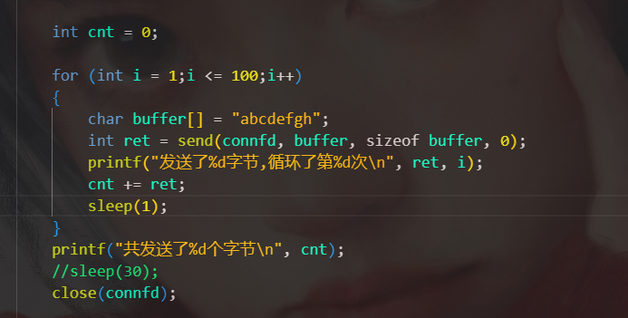

# send/recv内部是如何进行的

##### 1.send每次以长度为标准，而不以字符串\0的方式识别终止

可见send是每次发送100字节，不管里面是字符串是何时结束

##### 2.send不可能因为对方没有发送而阻塞，send是从内核协议栈缓冲区中提取数据的。内核缓冲区获取数据的速度不与send从数据移到用户区的速度相同

##### 3.数据到tcp内部的过程不是与send同步的

这里由2和3可以推出，send一定的对象一定是从tcb协议栈里面的缓冲区里取数据。如果缓冲区为0字节那么直接返回，如果tcb协议栈有数据，那么按send的尺寸进行读取。

同时根据之前的知识也可以推导，send阻塞的原因是因为协议栈的缓冲区本该接收数据但是没有准备好数据

##### 4.send接收的数据大小一定等于recv发送的

##### 5.send会不会阻塞，看当前主机的tcb的吞并量速度，如果send的吞并量（bytes/s)小于tcb发送数据的吞并量那么不会阻塞

##### 6.本端tcb缓冲区虽然满了，但是只要对端发送过来的数据，本端虽然缓冲区有限制无论对端是否关闭连接，本端一定会把数据拿出来

这个结果是在对端关闭的时候仍然能获得30000字节，说明内核不仅维护读写缓冲区，硬件或者内核反正有一个能够容纳未被TCB缓冲区接收的数据的容器

##### 7.从上面推出发送时，大小一定要指定发送字符串的大小，否则会出现一些未定义的情况

##### 8.看看粘包问题，怎么产生的

对端发送的数据包

每次8字节

本端接收每次512字节。

我本意是想读取对端发来的一次，我接收一次。

现在结果是这样的，产生这种情况的原因是，本端在接收数据的时候，对端已经把所有数据发送过来了，再次接收就会每次以BUFFER_SIZE的尺寸去接收，导致一次性把一个块状的数据读出来，而不是以行的形式读。所以这就是粘包问题。

如果我放慢recv的速度。

达到同步。

故根本原因是，当recv和send的速度不一致时没有一个序列化的结构来识别数据。