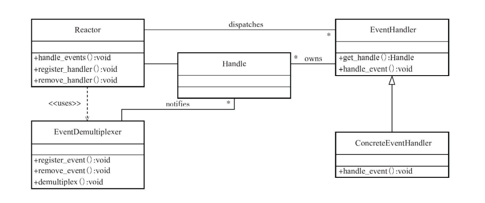
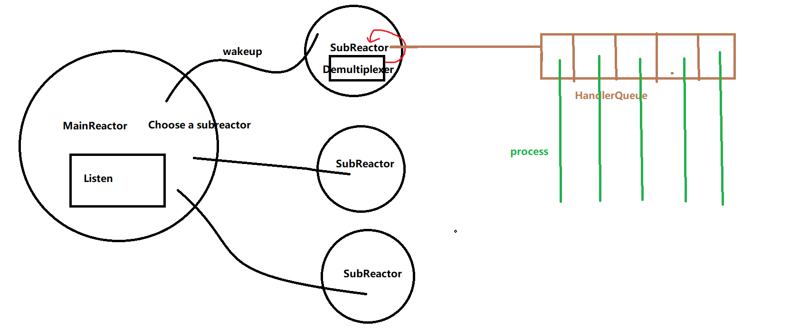

# 基于Reactor设计模式+半同步/半异步的并发模式的TCP底层架构


## Reactor设计模式

##### 类图



##### 顺序图


## 半同步/半异步的并发模式

选择半同步半异步的并发模式效率更优于半同步半反应堆，MainReactor与SubReactor是异步关系，而不是后者的同步关系，后者的同步关系造成了它们处于同一阻塞队列，n个Reactor，其中一个Reactor对该队列上操作任何元素会阻塞n-1个Reactor包括MainReactor，这是锁保护造成的性能损失。其次是后者一个线程只能处理一个任务，容易造成网络阻塞。半同步半异步并发模式刚好解决了所有，相应的维护难度系数会增加。





## 对应实现

### 三大组件

##### 1.Reactor——Control类

```cpp
class Control{
    ......
	void loop();        //Run the Reactor
    void quit();        //Quit the Reactor
    void updateHandler(Handler* channel);            //Update the EventHandler
    void removeHandler(Handler* channel);            //Remove the EventHandler
}
```

Reactor，整个模式的核心

##### 2.EventDemultingplex——Eventmonitor类

```cpp
class Eventmonitor : public Poller
{
public:
	....
    Timestamp poll(int timeoutMs, HandlerList* ActiveHandlers) override;        //Run the Demultiplex And Return the ActiveHandlers to Reactor (Override the Poller)
    void updateHandler(Handler *handler) override;                              //Called by Reactor.Creat the Handler in this EventDemultplex,the fd will be register on epoll tree
    void removeHandler(Handler *handler) override;                              //Called by Reactor.Delete the Handler in this EventDemultplex
    ....    
}

```

EventDemultingplex,监听事件，定时返回（非阻塞定时返回），并将就绪事件返回Reactor

##### 3.Handler——Handler类

```cpp
class Handler : noncopyable
{
public:
    ......
    void handleEvent(Timestamp receiveTime);  
    ......
}
```

事件处理器，记录相关句柄以及事件处理回调，只有Handler知道句柄对应的回调函数.通过Reactor调用Handler.


### 封装

##### 1.ListenExcutor

封装listenfd。封装接收IO连接处理模块（设置Socketfd属性，启动监听，注册MainReactor里的EventDemultplex里，收到连接执行相应回调（由其他模块给的连接回调））。

##### 2.TcpConnection

封装一条连接。封装从全监听队列得来的cfd以及每个cfd唯一标识的资源（如Buffer,Handler等).

##### 3.TcpServer

封装运作底层的逻辑以及相应资源，TcpServer将TCP运作各种逻辑全部封装，包括ListenExcutor接收到对应的回调，TcpConnection为Handler注册的回调具体实现都是由TcpServer传递。


# 业务修饰：TcpServer to HTTPServer

