# 开发日志

时间来到了11/27，基本三大组件即Control,Handler,Eventmonitor已经完成，写完后尝试编程时发现代码用起来并不轻松，每次写任何一个服务器都需要深入底层考虑运转细节，然后再编程序，于是写了一个开发日记，用以慢慢迭代提高封装层，使得代码一步步效率更高，并记录迭代过程，最后总结开发经验，

## 为什么要抽象一层LfdHandler? 

start :11/27

如果不抽象这一层LfdHandler，可以看下面的代码，将过多细节暴露给用户，代码复杂，需要考虑过多程序运转细节不说，更不具有灵活性（比如说，我想在连接时加入一段信息，想加入一个回调函数怎么办？在主线程中写一个回调函数，需要用户自己控制），main的代码的耦合性很高，为了减少main这些缺点，于是封装一层LfdHandler。 

```cpp
int Creatlfd()
{

    const char* ip = IP;
    int port = atoi(PORT);
    struct sockaddr_in address;
    bzero(&address, sizeof address);
    address.sin_family = AF_INET;
    inet_pton(AF_INET, ip, &address.sin_addr);
    address.sin_port = htons(port);


 
    int sock = socket(PF_INET, SOCK_STREAM, 0); 
    assert(sock >= 0);

    int ret = bind(sock, (struct sockaddr*)&address, sizeof(address));
    assert(ret != -1);

    ret = listen(sock, BACK_LOGLENGTH);
    assert(ret != -1);

    return sock;
}


void AcceptorhandleEvent(int fd)
{
    struct sockaddr_in client;
    memset(&client, 0, sizeof client);
    socklen_t client_addrlength = sizeof(client);
    int connfd = accept(fd, (struct sockaddr*)&client, &client_addrlength);
    if (connfd < 0)
    {
        printf("errno is :%d\n", errno);
    }
    else
    {
        char remote[INET_ADDRSTRLEN];
        printf("远端：IP:%s PORT:%d 已经连接\n", inet_ntop(AF_INET, &client.sin_addr, remote, INET_ADDRSTRLEN), ntohs(client.sin_port));

        //Control * selectedreactor = SelectReactor();
        //Handler handler()

        close(connfd);
    }
}


int main()
{
    Control mainReactor; //创建反应堆

    Socket lfd(Creatlfd()); //创建Socket
    lfd.setReusePort(true);  

    Handler Acceptor(&mainReactor, lfd.fd());
    Acceptor.enableReading();    //事先预置好lfd对应的事件处理器Acceptor并加入主reactor的事件分发器中
    Acceptor.setReadCallback(bind(AcceptorhandleEvent,Acceptor.fd())); //为lfd设置处理读事件回调

    mainReactor.loop(); //启动循环
	return 0;
}
```


在新增的LfdHandler考虑如下因素

1.提高灵活性：增加一个NewConnection回调

2.提高封装性：封装句柄Handle,封装事件处理器Handle

##### 意外错误

封装过程中出现了一些意料之外的错误，DEBUG时找到了一个巨坑：

```cpp
LfdHandler::LfdHandler(Control* reactor, const InetAddress& lfdAddr, bool Reuseport)
        :ownreactor_(reactor),
        lfdSocket_(Creatlfd()),
        Acceptor_(reactor,lfdSocket_.fd()),
        listenning_(false)
{
    lfdSocket_.setReuseAddr(true);
    lfdSocket_.setReusePort(true);
    lfdSocket_.bindAddress(lfdAddr);
    Acceptor_.setReadCallback(bind(&LfdHandler::HandleRead,this));
}
```

本意想先初始化lfdSocket，因为Acceptor_的初始化依赖lfdSocket，但是实际上编译器是先Acceptor后初始化lfdSocket，这就导致了未知的情况发生。

原因出在这里

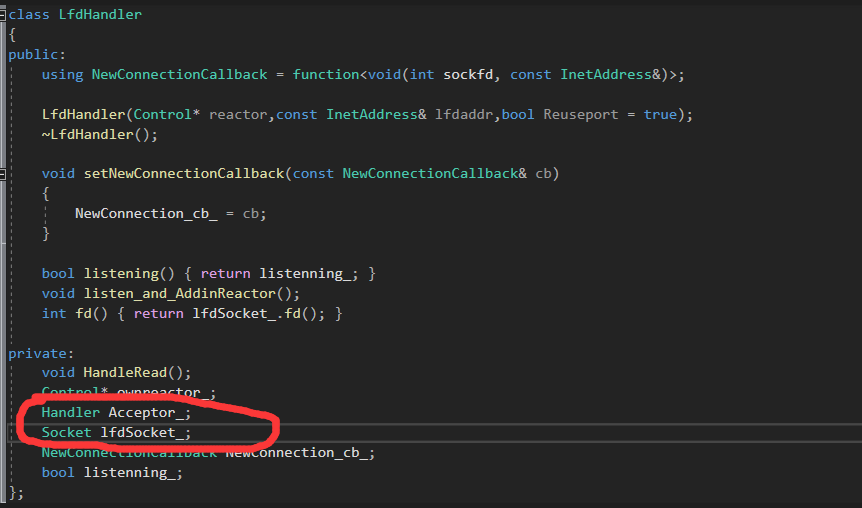

应该改成这样

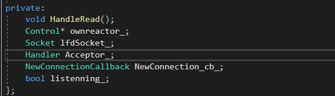


原因为：**成员变量在使用初始化列表初始化时，与构造函数中初始化成员列表的顺序无关，只与定义成员变量的顺序有关。**因为成员变量的初始化次序是根据变量在内存中次序有关，而内存中的排列顺序早在编译期就根据变量的定义次序决定了。（参考Effective C++)

如果不使用初始化列表初始化，在构造函数内初始化时，此时与成员变量在构造函数中的位置有关。


（害，又得重新把所有组件的初始化列表看下了qaq）


##### 重新整理

封装整理后的主程序代码（为句柄封装Socket增加了accept,listen, 增加了一个地址封装InetAddress，增加了一个LfdHandle封装Tcp底层的IO连接模块）

```cpp
using namespace std;
using namespace placeholders;

void AcceptorhandleEvent(int sockfd, InetAddress addr)
{
    printf("远端：IP:%s PORT:%d 已经连接\n", addr.toIp().c_str(), addr.toPort());
    close(sockfd);
}

int main()
{
    Control mainReactor;
    InetAddress addr(12346, "192.168.154.128");
    //封装后的IO处理器
    LfdHandler LfdAcceptor(&mainReactor, addr);
    LfdAcceptor.setNewConnectionCallback(bind(AcceptorhandleEvent, _1, _2));
    LfdAcceptor.listen_and_AddinReactor();
    mainReactor.loop(); //启动循环
    
	return 0;
}
```


是不是用起来更容易？而且灵活性更大，你只需要写一个回调函数即可，像底层的监听，获取全连接队列accepte，LfdHandler自动帮你完成，对比刚开始的那一种这样能够大大的分离底层TCP架构逻辑与业务逻辑，

重新整理后用telnet测试一下


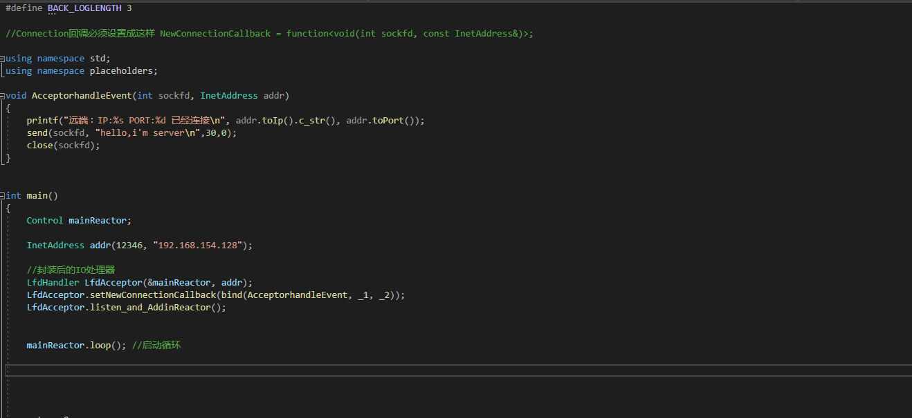

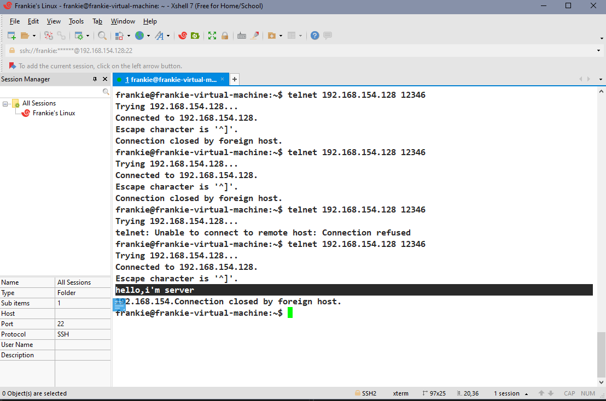

连接成功， 没问题。

测试多连接

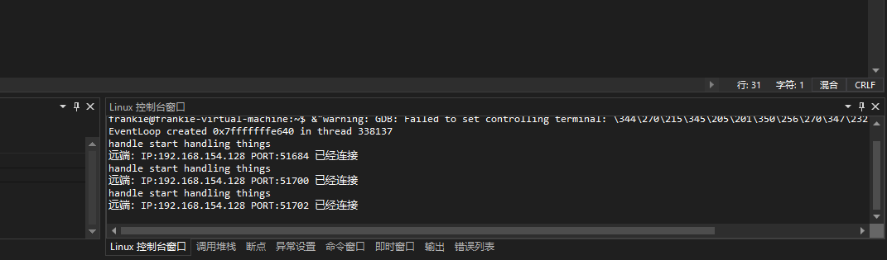

代码只有下列简简单单的几行

```cpp
//Connection回调必须设置成这样 NewConnectionCallback = function<void(int sockfd, const InetAddress&)>;

using namespace std;
using namespace placeholders;


void AcceptorhandleEvent(int sockfd, InetAddress addr)
{
    printf("远端：IP:%s PORT:%d 已经连接\n", addr.toIp().c_str(), addr.toPort());
    close(sockfd);
}


int main()
{
    Control mainReactor;

    InetAddress addr(12346, "192.168.154.128");

    //封装后的IO处理器
    LfdHandler LfdAcceptor(&mainReactor, addr);
    LfdAcceptor.setNewConnectionCallback(bind(AcceptorhandleEvent, _1, _2));
    LfdAcceptor.listen_and_AddinReactor();


    mainReactor.loop(); //启动循环
	return 0;
}
```

但是，还不够，可以看到回调需要我们自己手动设置参数等等这些琐碎的事物，一个服务器不仅仅有连接回调，还有读回调，写回调，如果都是我们手动设置这些琐碎的事物，我们肯定是要深入到底层（比如想设置lfdHandler的回调就要深入lfdHandler里面的构造函数需要哪些参数），这样的话，我们依然要深入到底层去，还是没有完全分离业务逻辑和底层架构。所以为了开发效率更加高，可以思考一下再封装一层将这种回调设置的细节给隐藏，呈现出来的只要你写一个回调然后简简单单的调用设置而不用考虑更多参数细节，即完全的隐藏细节。


## 测试多线程

start 11/28

到目前为止，只测试过单线程的Reactor，现在测试多线程Reactor，看有没有问题

首先确定：每个线程只能进入属于自己的reactor中的loop里面，其他线程是进不来loop的，因为在线程启动那一刻就始终在loop之中，要么退出loop终结生命,要么一直loop循环。有可能为了传pendingfunc（即reactor间需要通信）需要传送消息（pending回调函数），暂时去其他的reactor里面（去里面先判断该线程是不是拥有该reactor若没有则queueInloop唤醒属主线程，若有则有权限直接执行runInloop），但是任务执行只能由本reactor所属的线程执行（因为pending的处理在loop中，进入loop只有用于该reactor的线程）

```cpp
void WokerThread::ThreadFunction()                  //底层线程执行的函数
{
	
	Control reactor;
	if (Initcb_)
	{
		Initcb_(&reactor);
	}
	{
		unique_lock<mutex> lock(mutex_);
		reactor_ = &reactor;
		cond_.notify_one();
	}
	reactor.loop();
	unique_lock<mutex> lock(mutex_);
	reactor_ = nullptr;

}
```

总结一下：

1.所有reactor执行任务只能在loop中执行。 

2.只有属主线程才拥有loop的入口，进入loop唯独只有属主线程。

3.非属主线程可以进入其他reactor但不能进入loop，只能传递信息然后唤醒属主线程。


通过以上三条结论，去测试


##### 死锁错误

DEBUG过程中，发现

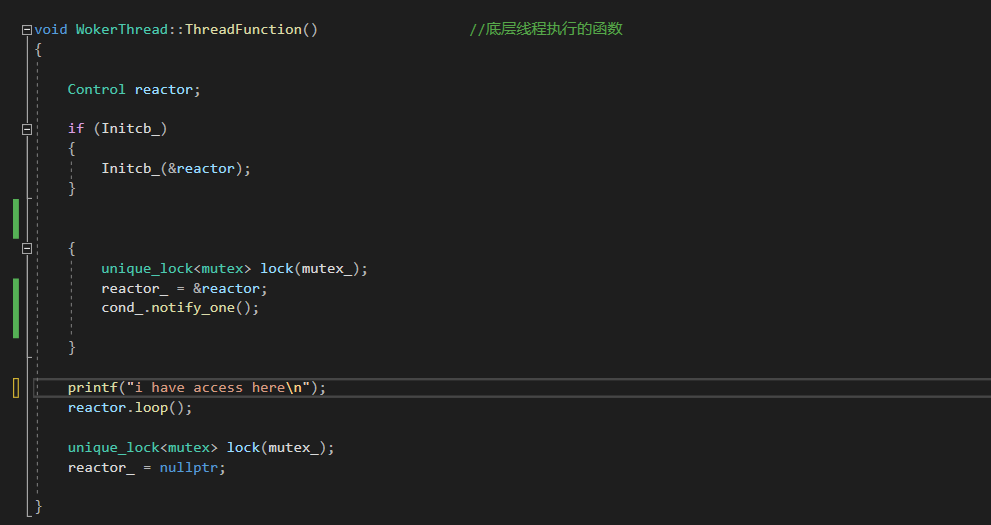

子线程能够到达这里，说明已经给主线程管理的Workerthread的reactor_成员变量赋值过，而主线程发生死锁阻塞。

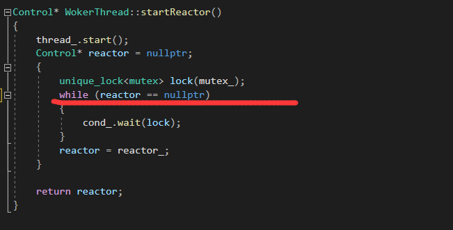

原来是这里，条件变量循环的条件应该是子线程赋过的变量reactor_不该为nullptr。这里出了问题

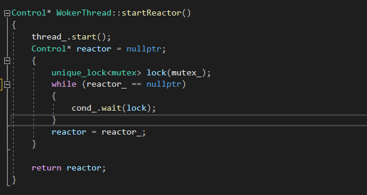

改成这样即可


##### 开始测试多线程机制是否有效

```cpp
using namespace std;
using namespace placeholders;

void HandleGivenHandle()
{
    printf("OK,main thread has wakeme up\n");
    printf("I'm the subthread %d\n", CurrentThread::tid());
}


void AcceptorhandleEvent(int sockfd, InetAddress addr,Control* subreactor)
{
    printf("I'm the mainthread %d\n", CurrentThread::tid());
    //printf("远端：IP:%s PORT:%d 已经连接\n", addr.toIp().c_str(), addr.toPort());
    //封装一个Handler，并将该Handler传给subreactor
    //可以设置一个functor传给subreactor的pendingfunctor队列里面，然后唤醒它执行即可。内容：封装一个Handler,并上树。

    auto func = bind(HandleGivenHandle);
    subreactor->queueInLoop(func);

    close(sockfd);
}


int main()
{
    Control mainReactor;

    InetAddress addr(12346, "192.168.154.128");

    WokerThread subreactor1_th;
    Control* subreactor = subreactor1_th.startReactor(); //选择一个subreactor

    //封装后的IO处理器
    LfdHandler LfdAcceptor(&mainReactor, addr);
    LfdAcceptor.setNewConnectionCallback(bind(AcceptorhandleEvent, _1, _2, subreactor));
    LfdAcceptor.listen_and_AddinReactor();

    mainReactor.loop(); //启动循环
	
 
	return 0;
}
```

大意是：主线程先构造一个Reactor，然后绑定监听IO模块，子线程也创建一个子Reactor,等待子线程创建完Reactor后并开始循环监听后，然后主线程开始循环监听。 

当有IO线程到来时，主线程做的事即为`AcceptorhandleEvent`,先打印出主线程ID，后包装HandleGivenHandle可调用对象传递给subreactor，并唤醒它执行该pendingFunctors,然后子线程执行该回调的内容：打印相关内容以及自己的线程ID。

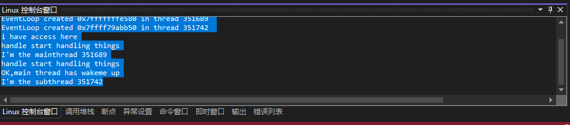

测试成功，说明多线程唤醒机制功能以及处理由主线程带来的pending回调功能没问题没问题。


## 提高并发效率——增加线程池

start 11/29

为什么要增加线程池在另外一篇文章详细说过。

两种线程池，一种是同步队列式的这是半同步半反应堆，不如半同步半异步的线程池，后者也更符合Reactor模式。故选择后者。

线程的选择策略采用Round Robin算法(其实就是轮询，说的高大上而已hh).

##### 测试


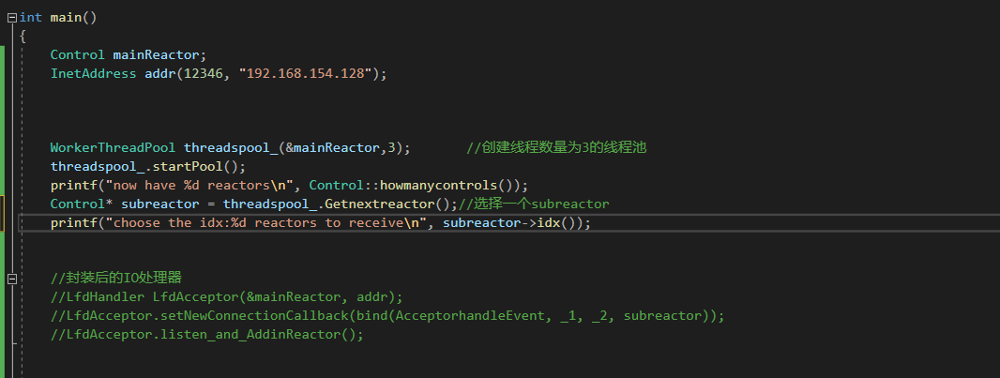

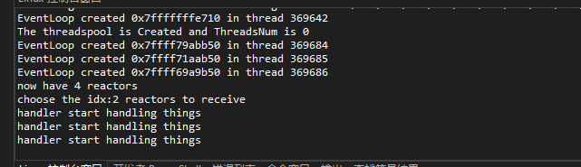

看似没问题

将注释掉的全部拿开


```cpp
//Connection回调必须设置成这样 NewConnectionCallback = function<void(int sockfd, const InetAddress&)>;
//多线程传递函数回调必须设置成这样 Functor = function<void()>;

using namespace std;
using namespace placeholders;

void HandleGivenHandle()
{
    printf("OK,main thread has wakeme up\n");

    printf("I'm the subthread %d\n", CurrentThread::tid());
}


void AcceptorhandleEvent(int sockfd, InetAddress addr,Control* subreactor)
{
    printf("I'm the mainthread %d\n", CurrentThread::tid());
    //printf("远端：IP:%s PORT:%d 已经连接\n", addr.toIp().c_str(), addr.toPort());
    
    //封装一个Handler，并将该Handler传给subreactor
    //可以设置一个functor传给subreactor的pendingfunctor队列里面，然后唤醒它执行即可。内容：封装一个Handler,并上树。

    auto func = bind(HandleGivenHandle);
    subreactor->queueInLoop(func);

    close(sockfd);
}


int main()
{
    Control mainReactor;
    InetAddress addr(12346, "192.168.154.128");

    WorkerThreadPool threadspool_(&mainReactor,3);       //创建线程数量为3的线程池
    threadspool_.startPool();  printf("now have %d reactors\n", Control::howmanycontrols());
    Control* subreactor = threadspool_.Getnextreactor();//选择一个subreactor     
    
    //封装后的IO处理器
    LfdHandler LfdAcceptor(&mainReactor, addr);
    LfdAcceptor.setNewConnectionCallback(bind(AcceptorhandleEvent, _1, _2, subreactor));
    LfdAcceptor.listen_and_AddinReactor(); //Lfd加入mainReactor

    mainReactor.loop(); //启动循环
	
 
	return 0;
}
```

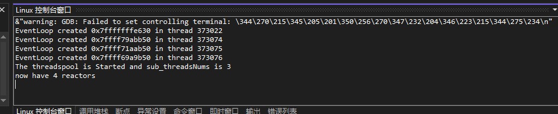


然后telnet连接看看有无反应。

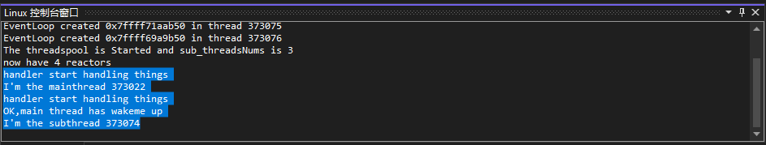

一个主线程发任务给子线程，没问题。

再试试轮询算法是否有效

```cpp
using namespace std;
using namespace placeholders;


Control mainReactor;
InetAddress addr(12346, "192.168.154.128");
WorkerThreadPool threadspool_(&mainReactor, 3);       //创建线程数量为3的线程池


void HandleGivenHandle()
{
    printf("OK,main thread has wakeme up\n");

    printf("I'm the subthread %d\n", CurrentThread::tid());
}


void AcceptorhandleEvent(int sockfd, InetAddress addr)
{
    printf("I'm the mainthread %d\n", CurrentThread::tid());
    //printf("远端：IP:%s PORT:%d 已经连接\n", addr.toIp().c_str(), addr.toPort());
    Control* subreactor = threadspool_.Getnextreactor();//选择一个subreactor    
    //封装一个Handler，并将该Handler传给subreactor
    //可以设置一个functor传给subreactor的pendingfunctor队列里面，然后唤醒它执行即可。内容：封装一个Handler,并上树。

    auto func = bind(HandleGivenHandle);
    subreactor->queueInLoop(func);

    close(sockfd);
}


int main()
{
    threadspool_.startPool();  printf("now have %d reactors\n", Control::howmanycontrols());
       
    //封装后的IO处理器
    LfdHandler LfdAcceptor(&mainReactor, addr);
    LfdAcceptor.setNewConnectionCallback(bind(AcceptorhandleEvent, _1, _2));
    LfdAcceptor.listen_and_AddinReactor(); //Lfd加入mainReactor

    mainReactor.loop(); //启动循环
	
 
	return 0;
}
```


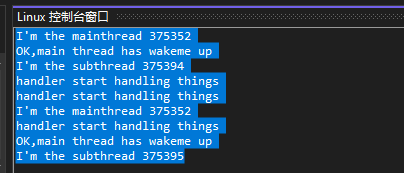

轮询选择线程，没问题。

线程池增加了，效率提高了。接下来就是进一步封装了


## 用户的数据缓冲区Buffer类的引入

start 11/29

应用程序为什么需要Buffer类的数据？non_blocking+IO复用application必须要有输出缓冲区(outbuffer)类，如果没有Buffer,从IO读过来的数据要传输对端（如100kb）如果一次性没读完(只读80kb，内核缓冲区大小有限)，那么返回-1，然而身处non_blocking+IO复用，那必然是等待下一次可写，我们可以等待下一次继续写入对端cfd，但是这个IO可能被其他事件也引用过，这会改变该IO的lseek，那么就找不到之前继续写的位置了，这就是无stateful的传输数据。我们需要保存状态，中间加一层buffer,一次性从IO读出来到buffer,然后从buffer发送到对端，一次没发完（只发80K），则注册该cfd的可写事件监听，下次写，这个时候buffer记录到这个状态，所以可以继续接着发。有状态的数据传输(buffer)，还可以配合coder解码处理任何需要解决分包，粘包的场景。


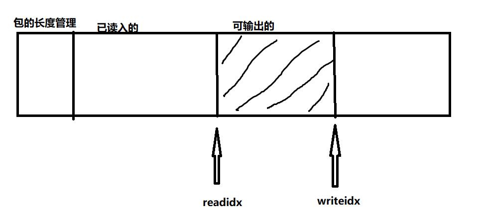

对于接收端的inbuffer,若对数据有序列化的要求，高层协议（如http等)控制数据传输对于buffer可以直接收，若没高层协议控制，则需要自己制定一个协议用以序列化，包的长度管理即是来控制这个要求的。

## 不可少的连接类——TcpConnection

start 11/29

可以想象，站在现在的抽象程度上，那么任意一个连接到来，(指的是多线程情况下）都会经过LfdHandler建立连接，LfdHandler会将该连接建立好然后选择一个SubReactor并传输消息：**你给我把这个连接封装成Handler然后放入你的分发器中监听。** 要封装Handler这件事用户可以做，但是用户做好吗？显然不好，为什么？原理和为什么要封装LfdHandler一样，暴露过多细节，使用不易。于是需要一个类用来打包收到mainReactor传来的连接,提升subReactor的抽象程度。这个类不仅可以封装打包Handler,而且还可以容纳建立这个连接的两端信息,数据缓冲区等，灵活性就体现出来了（可想而知要是没有封装，将这些“无关”代码堆积在主要逻辑代码区上维护起来是一件多么难受的事情）。 （Handler为了绑定TcpConnection增加一个tie）

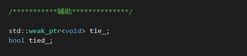


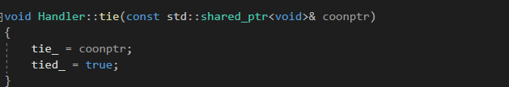


现在写服务器需要像下面这样

```cpp
using namespace std;
using namespace placeholders;


Control mainReactor;
InetAddress addr(12346, "192.168.154.128");
WorkerThreadPool threadspool_(&mainReactor, 3);       //创建线程数量为3的线程池，即创建3个子reactor
unordered_map<int, TcpConnectionPtr> connections_; //连接索引
static int connidx = 0;


void HandleGivenHandle()
{


}


/*  监听到新连接后应该干什么      */
//主线程维护连接，将回调设置完后，让子线程将Handler加入到自己的Epoller中。
void newConnection(int sockfd, InetAddress peeraddr)
{
    Control* selecetedreactor = threadspool_.Getnextreactor(); //选取一个子reactor
    TcpConnectionPtr conn (new TcpConnection(selecetedreactor,"a",sockfd,addr,peeraddr));
    connections_[connidx] = conn;

    printf("have created the coon \n");

    conn->setMessageCallback(bind(HandleGivenHandle ) );
 
}


void run()
{
    

    threadspool_.startPool();  printf("now have %d reactors\n", Control::howmanycontrols()); //子reactor启动，准备就绪


    /* 创建LfdHandler,主Reactor里面的监听连接到来的事件处理器  */
    LfdHandler LfdAcceptor(&mainReactor, addr);
    LfdAcceptor.setNewConnectionCallback(bind(newConnection, _1, _2));
    LfdAcceptor.listen_and_AddinReactor();


    mainReactor.loop(); //主reactor启动循环监听
}


int main()
{
    
    run();

 
	return 0;
}
```

可以再提升抽象程度，抽象一个TcpServer，不然main区代码堆积太多，不易分业务逻辑和底层逻辑，于是再抽象一层TcpServer类


## 提升抽象层次——TcpServer 

start 11/30

网络编程本质上就是四个处理

1.连接的到来处理

2.连接的关闭处理

3.消息的到来处理

3.消息发送完后处理


其他的一切都是属于底层架构设计，现在提升抽象层次，让业务逻辑与底层逻辑完全分离。

到了这一步基本上已经全部分离，现在main逻辑如下

```cpp
#include "TcpServer.h"
#include "Logger.h"
#include <cstring>
#include <string>
#include <functional>

/*********************************************************************
 WriteCompleteCallback = function<void(const TcpConnectionPtr&)>;
 MessageCallback = function<void(const TcpConnectionPtr&,
 ConnectionCallback = function<void(const TcpConnectionPtr&)>;

 ********************************************************************/
using namespace std;
using namespace placeholders;

class DayTimeServer
{
public:
    DayTimeServer(Control* reactor,
        const InetAddress& addr,
        const std::string& name)
        : server_(reactor, addr, name)
        , reactor_(reactor)
    {
        
        server_.setConnectionCallback(
            bind(&DayTimeServer::onConnection, this, std::placeholders::_1)
        );

        server_.setMessageCallback(
            bind(&DayTimeServer::onMessage, this,_1, _2, _3)
        );

        server_.setThreadNum(1);
    }
    void start()
    {
        server_.start();
    }
private:
    
    void onConnection(const TcpConnectionPtr& conn)
    {
        if (conn->connected())
        {
            //Coming doing
            LOG_INFO("Connection Coming : %s", conn->peerAddress().toIpPort().c_str());
        }
        else
        {
            //Close doing
            LOG_INFO("Connection Closed: %s", conn->peerAddress().toIpPort().c_str());
        }
    }
    
    void onMessage(const TcpConnectionPtr& conn,
        Buffer* buf,
        Timestamp time)
    {
        //string msg = buf->retrieveAllAsString();  //Get the info from Buffer to msg
        string msg = Timestamp::now().toString();
        char buf1[50]; 
        memset(buf1, '\0', sizeof buf);
        strcat(buf1, msg.c_str());
        strcat(buf1, "\n");
        
        conn->send(buf1); //send msg to peer sockfd
        conn->shutdown(); //shutdown write.this is half close. 
                          //If we active close the connection ,then we just shutdown on write (If the outBuffer still have 		                             datas,we wait the datas send done then shutdownwrite) , wait the peer's info coming and receive.                                 And if we read 0 then we will call handleClose() ,and close the connection. 
    }

    Control* reactor_;
    TcpServer server_;
};

int main()
{

    //cout << Timestamp::now().toFormattedString() << endl;
    Control reactor;
    InetAddress addr(12346,"192.168.154.128");
    DayTimeServer server(&reactor, addr, "DayTimeServer-01"); 
    server.start(); 
    reactor.startloop(); 

    return 0;
}
```

现在的main逻辑只有业务逻辑,达到了底层与业务逻辑的分离


## 底层架构完成，整理总结

start 12/1 

## 升级至HttpServer 

start:12/2

##### 1.从状态机：解析行——Parse_line

为了充分利用Buffer,给Buffer增加对应接口，用以外部手动操作Buffer。

给外部暴露了readerIndex和writeIndex,使用时注意一点，要用引用接收，因为用到这种场景是一般要自己手动分析Buffer里面的数据，外部对ReadIndex改了必须要同步到Buffer里，故要用引用接收.

```CPP
   /*******manually Opration  Buffer ******/
    //should use ref receive
size_t& Getreadidx() { return readerIndex_; } //注意！要用引用接收，这里给了灵活度，但是不安全。不能让readerIndex_大于writerIndex_
size_t& Getwriteidx() { return writerIndex_; }

char& operator[](size_t idx)
{
    return buffer_[idx];
}
```

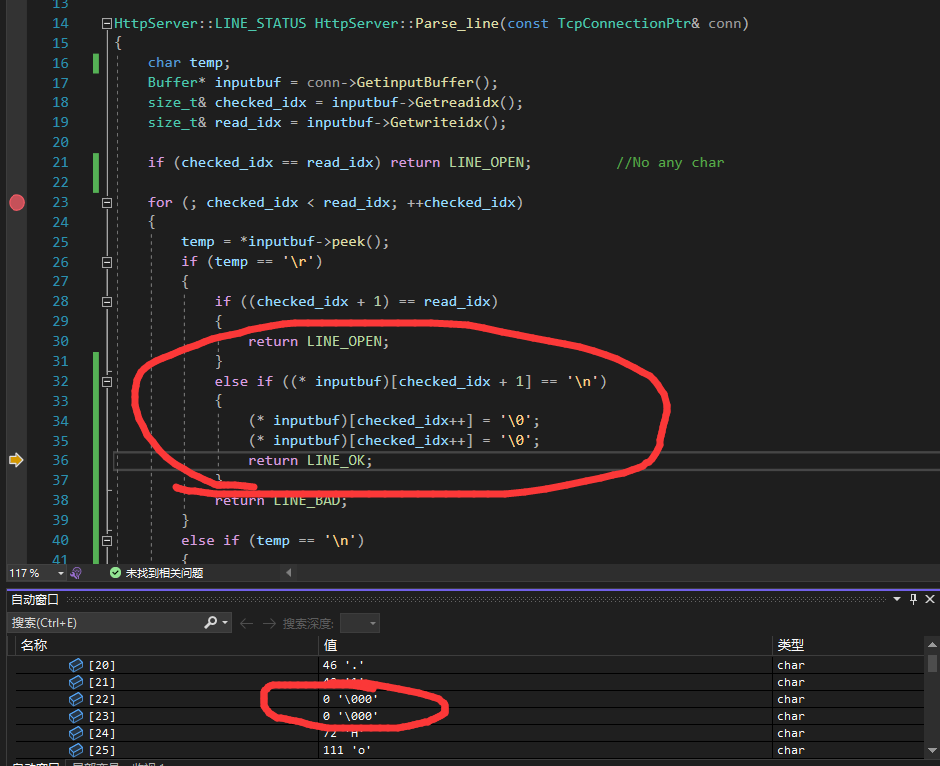

测试没问题

读数据的时候注意如果有一次没完全读完，我们的底层架构模型是非阻塞+IO复用，这次没读完可以等待下次，而且我们的Buffer自动会帮我们保证数据的完整性。

##### 2.主状态机：解析数据——Process_Read

为了使用Buffer更方便，给TcpConnection加上对ReadIdx和WriteIdx的引用。

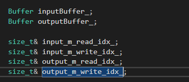

##### 3.三种行解析

请求行，头部行，内容行的测试

先说下状态机的逻辑：

由从状态机推动主状态机运动，主状态机首先是CHECK_STATE_CONTENT,然后由从状态机返回的LINE进行推动，每一行每一行的读，读到LINE_OK继续读，在某一行返回LINE_OK的时候会改变（推动）主状态机的状态，返回LINE_BAD直接返回BAD_REQUEST。最后状态机结束时会返回一个状态

```cpp
 void onMessage(const TcpConnectionPtr& conn,
        Buffer* buf,
        Timestamp time)
 {
        auto p = buf->peek();
        printf("%s", p);
        init();
        Process_Read(conn);

        printf("1\n");
        conn->shutdown();
 }
```

大意：打印出浏览器发送过来的HTTP报文，然后处理数据。

```http
GET /asdasdasd.txt HTTP/1.1

Host: 192.168.154.128:12346

Connection: keep-alive

Cache-Control: max-age=0

Upgrade-Insecure-Requests: 1

User-Agent: Mozilla/5.0 (Windows NT 10.0; WOW64) AppleWebKit/537.36 (KHTML, like Gecko) Chrome/103.0.0.0 Safari/537.36

Accept: text/html,application/xhtml+xml,application/xml;q=0.9,image/avif,image/webp,image/apng,*/*;q=0.8,application/signed-exchange;v=b3;q=0.9

Accept-Encoding: gzip, deflate

Accept-Language: zh-CN,zh;q=0.9,en-GB;q=0.8,en-US;q=0.7,en;q=0.6
```

截取下来的，不知道为什么没有长度，开始看长度为0，我以为是程序写错了，后来发现浏览器没有发送长度报文。上面是从GOOGLE浏览器截取的

```http
GET / HTTP/1.1

Host: 192.168.154.128:12346

Connection: keep-alive

Cache-Control: max-age=0

Upgrade-Insecure-Requests: 1

User-Agent: Mozilla/5.0 (Windows NT 10.0; Win64; x64) AppleWebKit/537.36 (KHTML, like Gecko) Chrome/107.0.0.0 Safari/537.36 Edg/107.0.1418.62

Accept: text/html,application/xhtml+xml,application/xml;q=0.9,image/webp,image/apng,*/*;q=0.8,application/signed-exchange;v=b3;q=0.9

Accept-Encoding: gzip, deflate

Accept-Language: zh-CN,zh;q=0.9,en;q=0.8,en-GB;q=0.7,en-US;q=0.6
```

这个是MICROSOFT EDGE上截取的

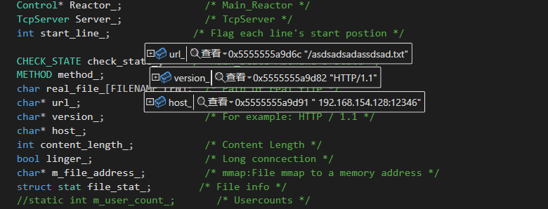

OK，这说明header和requestline都解析成功了，

现在是12/2，10点58，明天把response写完，就差不多了（劳累一天了，休息）。


改一部分

```cpp

void TcpConnection::handleWrite()
{
    if (handler_->isWriting())
    {
        int savedErrno = 0;
        ssize_t n = outputBuffer_.writeFd(handler_->fd(), &savedErrno);
        if (n > 0)
        {
            outputBuffer_.retrieve(n);
            if (outputBuffer_.readableBytes() == 0)
            {
                handler_->disableWriting();
                if (writeCompleteCallback_)
                {
                    
                    reactor_->queueInLoop(
                        std::bind(writeCompleteCallback_, shared_from_this())
                    );
                }
                if (state_ == kDisconnecting)
                {
                    shutdownInLoop();
                }
            }
        }
        else         //n==0 &&  handler_->== true      这是为了能够支持其他缓冲区，比如文件使用mmap，对应的文件长度总不可能把他再copy到应用层缓冲区吧，而框架的handlewrite只针对应用层缓冲区，如果应用层缓冲区为0，那么就关闭写事件，我有时候不仅要发应用层缓冲区也要发其他地方的数据，所以在writeCompleteCallback里面再注册事件，然后发送文件。如果还没发送完继续等待下一次。如果发送完了就不再注册事件。而由框架自动关闭
        {
            assert(outputBuffer_.readableBytes() == 0);
            handler_->disableWriting();
            if (writeCompleteCallback_)
            {
                reactor_->queueInLoop(
                    std::bind(writeCompleteCallback_, shared_from_this())
                );
            }
            
        }
    }
    else
    {
        LOG_ERROR("TcpConnection fd=%d is down, no more writing \n", handler_->fd());
    }
}

```


##### 测试重复连接

这块功能原书是完全没有的，害我DEBUG半天(qaq)

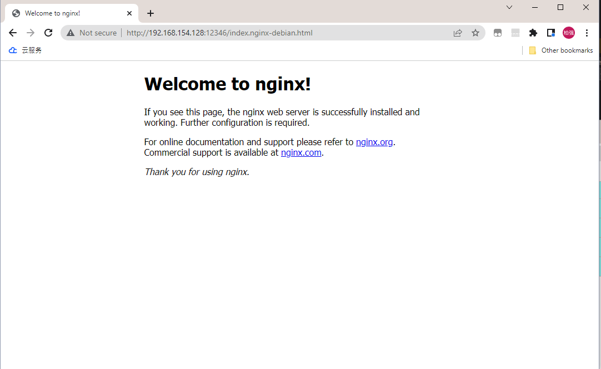

重复连接功能补全了没问题了。


##### 测试大文件传输

出现Broknpipe错误

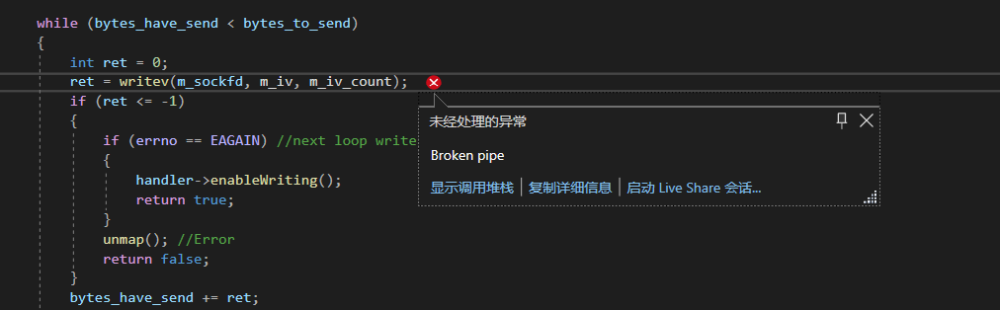

一开始以为是我逻辑BUG出问题了，后来发现原来不是，是GOOGLE客户端的原因


我数据发送过去了，但是GOOGLE没有识别，一直存在GOOGLE的缓冲区中最后导致GOOGLE的缓冲区满了将连接断开，于是就出现了BROKEN PIPE

然后换个浏览器FIREFOX试。

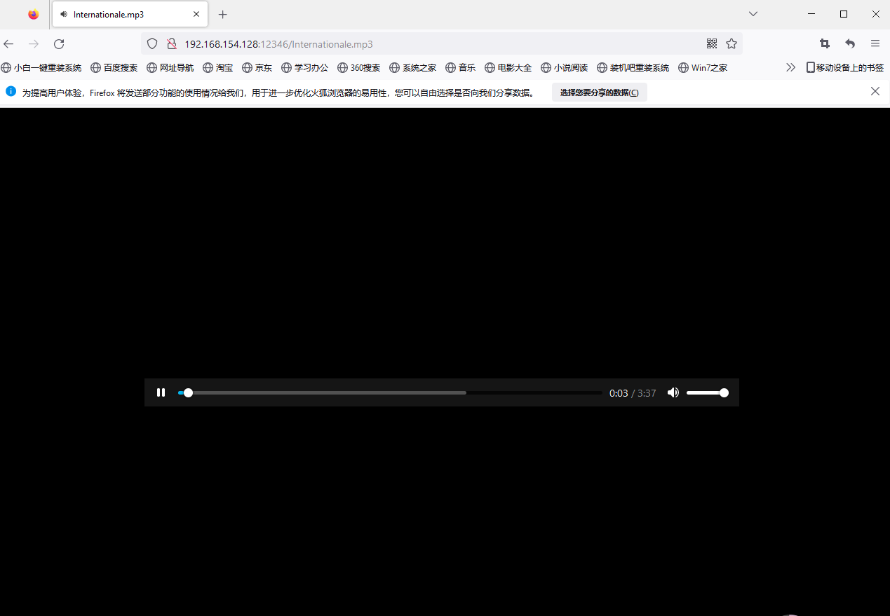


这是加载了一部分

读到差不多了

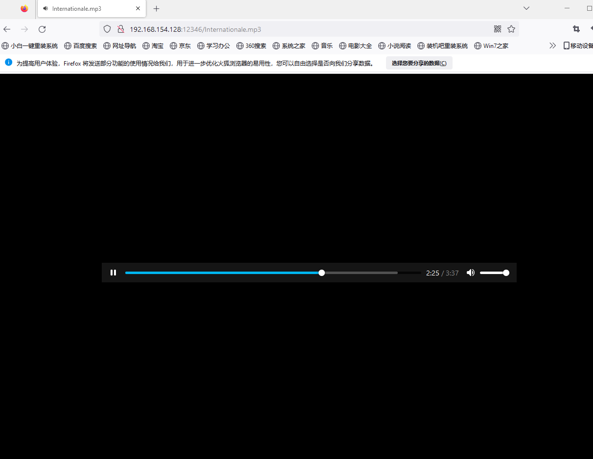

再次加载一次。此时其实已经加载完了

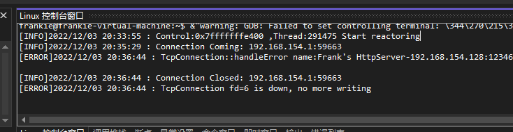

同时，我的服务器也收到反应。

第二次测试，增加信息

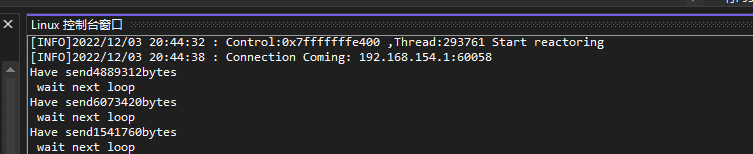
